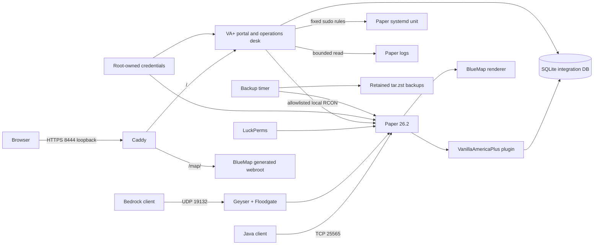

# Vanilla America+ architecture

## Decision

VA+ uses Paper 26.2 build 121 on Java 25 with Geyser 2.11.2 and Floodgate
2.2.5. This exact combination supports Java 26.2 and current Bedrock
26.0–26.40 at the review date. Paper keeps the experience client-mod-free and
avoids an unnecessary proxy or Fabric compatibility layer.

The operations desk is the custom Go portal rather than Crafty or Pelican.
Crafty has capable console, backup, and role support, but deploying it beside a
host-managed Paper unit would introduce a second lifecycle/filesystem authority
and broad container-daemon access. Pelican adds a panel, wings, and database
control plane that is disproportionate for one local server. The purpose-built
desk exposes only fixed systemd verbs, bounded log reads, allowlisted RCON
commands, reports, and test-shop operations. Paper's systemd unit remains the
single lifecycle authority.

BlueMap 5.23 renders the map. Its integrated all-interface webserver is
disabled; Caddy serves its generated webroot under the loopback-only VA+ HTTPS
origin. LuckPerms 5.5.81 is the only permissions authority. SQLite is the
local shared integration database.

## Topology

## Authority and persistence

- Lifecycle/console: `vanilla-america-plus.service`, with the administrator
  portal permitted only start, stop, restart, bounded log tail, and allowlisted
  RCON. Moderators receive none of these capabilities.
- Permissions: LuckPerms. VA+ idempotently adds only configured permission
  nodes for shop entitlements.
- Reports, entitlements, order state, moderator queue, sessions, and immutable
  staff audit: `/var/lib/vanilla-america-plus/integration/va-plus.db`.
- Worlds/config/plugins: `/var/lib/vanilla-america-plus/server`.
- BlueMap files: server plugin directory under the same state root.
- Credentials: `/var/lib/vanilla-america-plus/credentials`, root-owned and
  group-readable only by the two service identities.
- Backups: `/var/lib/vanilla-america-plus/backups`.

## Boundaries

The default `networkScope = "loopback"` binds Java and Geyser to loopback and
opens no firewall ports. Setting it to `"lan"` is the only declarative switch
that binds game listeners to all interfaces and opens exactly 25565/TCP and
19132/UDP. Web, Caddy upstream, RCON, SQLite, credentials, and administration
remain loopback/local in both modes. There is no UPnP or public exposure.

Sources reviewed 2026-08-30:

- https://docs.papermc.io/paper/getting-started/
- https://geysermc.org/wiki/geyser/supported-versions/
- https://geysermc.org/wiki/geyser/setup/
- https://github.com/BlueMap-Minecraft/BlueMap/releases
- https://docs.craftycontrol.com/pages/user-guide/user-role-config/
